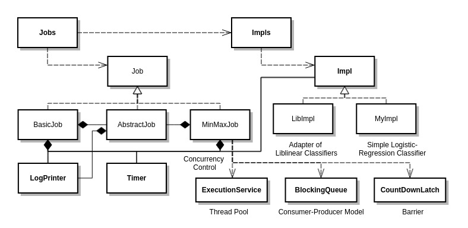
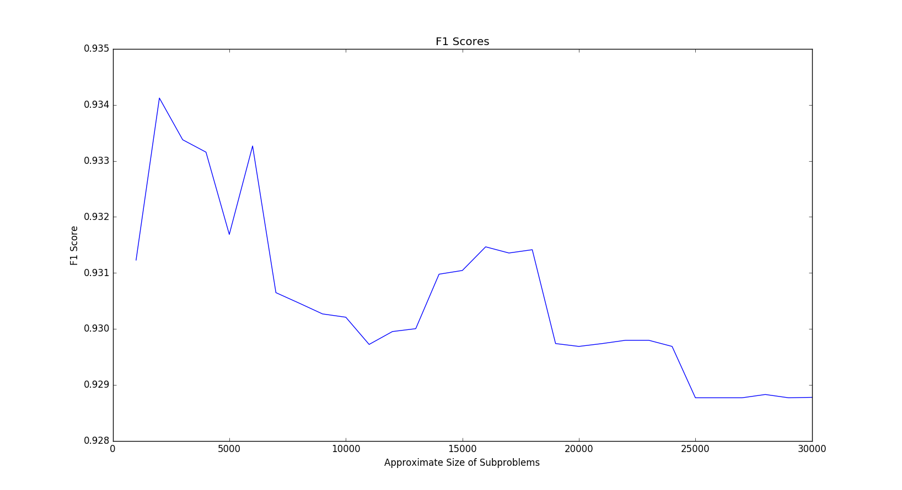
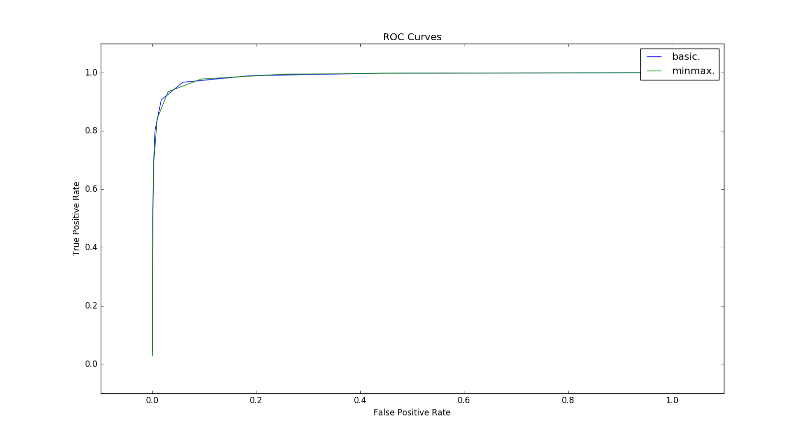
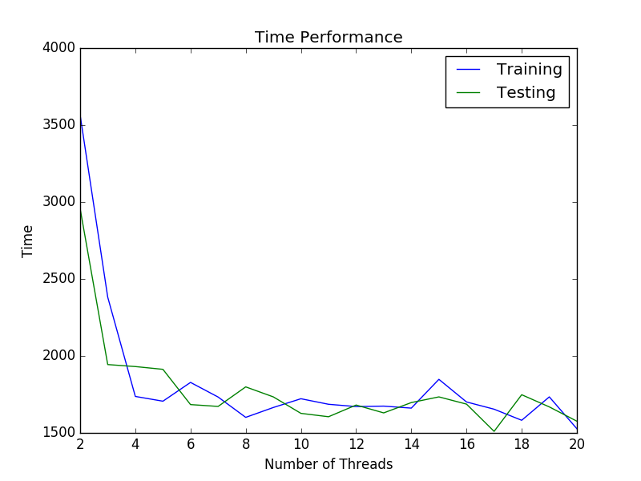

# M3-Network Patent Classifier

Multithreaded large-scale patent classification based on _[Min-Max Modular Network](http://bcmi.sjtu.edu.cn/~blu/papers/2014/3.PDF)_,
which attains an F1 score of 0.934181 compared to that of 0.925428 attained by the Libinear SVM classifier.

## Architecture

[Jobs](https://github.com/DevinZ1993/EI328-Min-Max-Classifier/blob/master/src/com/gmail/devinz1993/minmax/jobs/Jobs.java) is a static class serving as an entrance of the program.

[BasicJob](https://github.com/DevinZ1993/EI328-Min-Max-Classifier/blob/master/src/com/gmail/devinz1993/minmax/jobs/BasicJob.java) is a naive framework for the training and testing tasks of patent classification.

[MinMaxJob](https://github.com/DevinZ1993/EI328-Min-Max-Classifier/blob/master/src/com/gmail/devinz1993/minmax/jobs/MinMaxJob.java) is an intricate framework implementing M3 Network, which is based on a thread pool and the consumer-producer model.

[LibImplementor](https://github.com/DevinZ1993/EI328-Min-Max-Classifier/blob/master/src/com/gmail/devinz1993/minmax/impls/LibImplementor.java) is a wrapper class for the Liblinear library SVM classifier.

[MyImplementor](https://github.com/DevinZ1993/EI328-Min-Max-Classifier/blob/master/src/com/gmail/devinz1993/minmax/impls/MyImplementor.java) is a simple classifier based on Logisitc regression written by myself.

## Dependencies

[liblinear-java-1.95.jar](https://github.com/bwaldvogel/liblinear-java.git)

Apache Ant (optional)

## Build and Test  
  
(0) To build the program, put liblinear-java-1.95.jar into lib/ and type:

    ant

(1) To simply use LIBLINEAR library:

    ./scripts/run.py --liblinear  

Here is a sample result:

	BasicJob+LibImplementor t=0.0
	Training time: 1832 ms.
	Testing time: 541 ms.
	acc = 0.9646165246387551
	F1 = 0.9254280774164761
	TPR = 0.9066666666666666
	FPR = 0.016866880849280626

(2) To use LIBLINEAR in the M3 network:

    ./scripts/run.py --liblinear --minmax 

A sample result:

	MinMaxJob+LibImplementor m=2000 n=17 t=0.0
	Training time: 15460 ms.
	Testing time: 284106 ms.
	acc = 0.968506854390515
	F1 = 0.9341814159292036
	TPR = 0.9229508196721311
	FPR = 0.016936723006006425

(3) To use my simple Logistic classifier:

    ./scripts/run.py

A sample result:

	BasicJob+MyImplementor t=0.0
	Training time: 248853 ms.
	Testing time: 36 ms.
	acc = 0.9329381252315673
	F1 = 0.8617566830332788
	TPR = 0.8631693989071039
	FPR = 0.0447688224612376

(4) To use my Logistic classifier in the M3 network:

    ./scripts/run.py --minmax

A sample result:

	MinMaxJob+MyImplementor m=20000 n=4 t=0.0
	Training time: 192135 ms.
	Testing time: 287 ms.
	acc = 0.9336262107658921
	F1 = 0.8621523579201935
	TPR = 0.8571584699453552
	FPR = 0.041940215113842716

(5) To plot the F1 value line charts of both BasicTask and MinMaxTask:

    ./scripts/plot_f1.py

(6) To plot the ROC curves of both BasicTask and MinMaxTask:

    ./scripts/plot_roc.py

(7) To plot time performance line charts of MinMaxTask:

    ./scripts/plot_time.py 

(8) Warning: DO NOT run multiple tests simultaneously, because they may write to the same log file.

